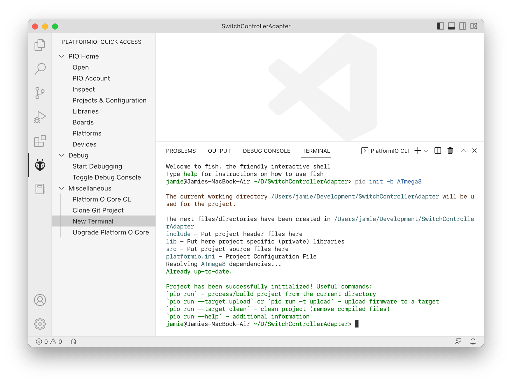
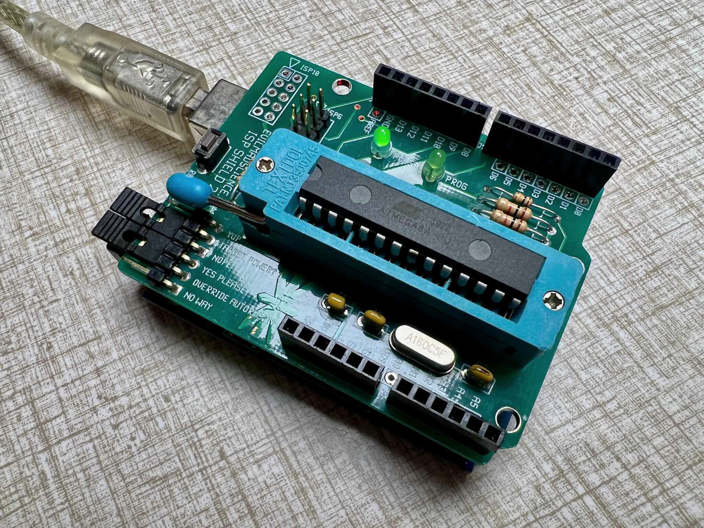

In this series of posts, I'm going to (attempt to?...) make a [Dual Shock](https://en.wikipedia.org/wiki/DualShock) to [Switch](https://www.nintendo.com/switch/) controller adapter. It will plug into the Switch Dock's USB port.

In doing this, I hope I'll learn about how USB works - something I've vaguely wondered about for at least twenty years - and have some fun doing low-level microcontroller programming. 

I'm also looking forward to stretching my writing muscles documenting the project here.

I'll be writing assuming a little knowledge of C-like programming languages (like, maybe what a pointer is) and basic electronics (maybe how to hook up an LED) - but I'll try to keep things pretty high level and approachable. I'm going to start with the 'setting up the development environment' and go all the way to 'using it to play Metroid', so hopefully the first article or two will also serve to document an easy way to start writing USB peripherals with modern software and questionably suitable hardware.

I hope it all works! If not, there might be an unexpeted twist later in the series (the anticipation!)[^foreshadowing]


## Game Controllers


Why Dual Shock to Switch? Well, I have a PS1-era Dual shock that still works great - I've recently used it with an equally ancient USB adapter to play on Stadia, RIP, on my Mac - and a Switch. I'd also like to be able to use a comfortable external controller to play Metroid Dread on my TV. It seems like it should be possible to put these two things together.

Yes, I _do know_ that it's easy to buy an awesome Nintendo Switch Pro Controller - or even [an adapter that will allow a Dual Shock 4 (and other controllers) to work with the Switch](https://www.8bitdo.com/wireless-usb-adapter-2/). But where's the fun in that?[^controllers]


## Microcontrollers

There are many, many ways to make USB accessories. 

I'm going to use one that's actually pretty long in the tooth now: the [ATmega8A microcontroller](https://www.microchip.com/en-us/product/ATmega8A). 

The ATmega8A pretty puny as microcontrollers go. 8 bit. 1 to 20MHz. Only 8K of flash program memory. 1K of RAM!

Part of a range of [AVR-instruction-set-based microcontrollers](https://en.wikipedia.org/wiki/AVR_microcontrollers), it's been around for twenty years (hey, like the Dual Shock!) - and has been very, very sucessful. There are probably a few in use in devices near you right now! The Arduino is based on its slightly bigger sibling, the ATmega328 - essentially an upgraded version of the ATmega8 with 32K of program space and 2K of RAM. The AVR range is still growing! In recent years, possibly because it's rather hard to justify calling a 16MHz processor with 32K of RAM 'Mega' nowadays, it looks like the 'ATtiny' name has won out over the 'ATmega' one for new products; [recent ATtiny chips are more powerful than the older ATmega ones](http://www.technoblogy.com/show?3UKF).

Fancier, more modern microcontrollers (even more modern AVR chips) have built-in hardware that talks USB - but the lowly ATmega8A does not. There are, though, software[^firmware] libraries that implement low speed USB at the cost of using up a few CPU cycles that could otherwise be used running application code. I'll be using [V-USB](https://www.obdev.at/products/vusb/index.html).

The ATmega8A is a slightly quixotic choice for 2022. Why am I using it instead of something like an [RP2040](https://www.raspberrypi.com/products/rp2040/) or an ARM SOC - or a board like a [Raspberry Pi Pico](https://www.raspberrypi.com/products/raspberry-pi-pico/) or a [Teensy](https://www.pjrc.com/teensy/)? Mainly because I have a stash of them in a drawer, and using them fits with the apparently frugal theme I've chosen for this project. Given their years-long popularity, they're still cheap and abundant - here are [10 possibly-recycled ones for $18 shipped on AliExpress](https://www.aliexpress.us/item/3256804797261223.html) - or [DigiKey has 14000 in stock for $3.28 each](https://www.digikey.com/en/products/detail/microchip-technology/ATMEGA8A-PU/1914639). It's probably possible to get a more capable chip for cheaper, but, again, I have these already.

I do like that they're easy to work with on breadboards (though you could say the same for a many small board-based systems like the Pi Pico or Teensy). 

If this works on an ATmega8A, really any ATmegaX8 or ATmegaXX8 chip with at least as much RAM and flash as should work with a very few tweaks to anything (the same programmer will even work). I suspact most any ATTiny chip with enough pins would work too - with maybe a little more tweaking.

I said this was a quixotic choice. You might assume that the small amount of program space and relatively slow processor will be problematic - or that it won't be easy to get going writing a USB accessory with an old microcontroller running a USB stack in software. I think that will not be the case, however! We'll find out if I'm right as the project progresses.

I'll be programming on my Mac using [Visual Studio Code](https://code.visualstudio.com) (the first time I've really used is in earnest), with [PlatformIO](https://platformio.org/platformio-ide) to manage the project and compiler toolchain and generally do the heavy lifting. PlatformIO is an _amazing_ development environment for almost every microcontroller you could imagine. The [PlatformIO](https://platformio.org/platformio-ide) web site has full installation instructions, including how to get and install VSCode.


## Setting up the development environment

Okay - let's create the project! PlatformIO has wizards to help with this - but I find it easiest to create a new folder, open it in VSCode, and use the command line to set up the project. 

You can get to a terminal that has everything set up for PlatformIO to work inside VSCode by opening the PlatformIO sidebar (the icon looks like an ant head) and choosing "New Terminal" (in the bottom of the sizdebar, "Quick Access" -> "Miscellaneous" -> "New Terminal").

Here we go! Just run `pio init -b ATmega8`



```
jamie@Jamies-Air ~/D/SwitchControllerAdapter> pio init -b ATmega8

The current working directory /Users/jamie/Development/SwitchControllerAdapter will be used for the project.

The next files/directories have been created in /Users/jamie/Development/SwitchControllerAdapter
include - Put project header files here
lib - Put here project specific (private) libraries
src - Put project source files here
platformio.ini - Project Configuration File
Resolving ATmega8 dependencies...
Already up-to-date.

Project has been successfully initialized! Useful commands:
`pio run` - process/build project from the current directory
`pio run --target upload` or `pio run -t upload` - upload firmware to a target
`pio run --target clean` - clean project (remove compiled files)
`pio run --help` - additional information
```

This creates a project set up for ATmega8A, with the Arduino framework. The Arduino framework isn't strictly necessary, but it provides some useful things, and the build system is pretty good about only including what's actualy used in the project in the compiled binary so we don't need to worry too much about it bloating the size.

I'll _not_ be using a bootloader on the chip. This will mean I need to program it with a 'programmer' every time, rather than just over a USB connection to it directly. The advantage of this is that the program space that would otherwise be needed to hold the bootloader program is available for use by our application program. And I guess it also fits the theme of being as 'minimal' as possible in this project - it feels like there's less to manage.

What's a programmer? I use an Arduino running the "ArduinoISP" ('In-System Programmer') sketch with Evil Mad Scientist's [ISP Shield](https://shop.evilmadscientist.com/productsmenu/253). 



You just program an Arduino with the example "ArduinoISP" sketch that comes in the Arduino IDE, attach the shield, and, boom, you've got a programmer. Attach it to a computer with USB, put the ATmega chip you want to program in the socket, and you can write a program to it. 

Instead of this setup, if you going for extreme minimalism, you could also just use [an Arduino, a breadboard, and some jumper wires](https://docs.arduino.cc/built-in-examples/arduino-isp/ArduinoToBreadboard)[^ArduinoISP] as a programmer. At the other end of the scale there are standalone programmers of [variable](https://www.amazon.com/dp/B0973X6XP3/) [degrees](https://www.olimex.com/Products/AVR/Programmers/AVR-ISP-MK2/open-source-hardware) of [officallness](https://www.microchip.com/en-us/development-tool/ATAVRISP2) and [sophistication](https://www.microchip.com/en-us/development-tool/atatmel-ice). Any one would likely work. One nice thing about the Evil Mad Scientist shield (and some others like it) is that it has a nice ZIF socket for putting the ATmega into. With most other programmers you need to arrange to connect up a 6 or 10 pin ribbon cable to the ATmega somehow - whether that's jumber wires to a breadboard, or [something extra like this](https://www.tindie.com/products/jeffmurchison/tinyloadr-avr-breakout/). I do like [this ingenious method.](https://www.tindie.com/products/ossiconelabs/isp-bridge-5atmel-attiny-x8-atmega-x8/)!

Anyway, enough digression. Let's tell PlatformIO and VSCode more more about our ATmega8A, and get it set up to use this thing.

I'd like to use the 8MHz oscilator to clock the ATmega. This will eliminate the need for an external [timing crystal](https://www.google.com/search?q=timing+crystal+for+ATmega8A) and associated circuitry - and also allow us to use the clock pins (pins 9 and 10 on the chip) as GPIO pins. I'm not sure if we'll actually need that many GPIO pins for this project - but it's a nice advantage to using the internal oscilator.

I'll actually be tuning the oscillator (really, slightly abusing the tuning mechanism) make it run at 12.8MHz - but more on that (and why I'm planning to do that) later.

To do all this, we'll need to 'burn the fuses' on the ATmega. This isn't as hard (or irreprable) as it sounds - it just means sending two eight bit settings values to the chip that it will store and use to set itself up when we power it on. The two values are referred to as the "low fuse" and "high fuse" - but they're just bytes that encode our settings. 

These two bytes are broken up into bits or group of bits traditionally referred to with an `ALL CAPS NAME`. You learn what they mean by reading relevant parts of the data sheet - or using an [online caculator like this one](https://eleccelerator.com/fusecalc/fusecalc.php?chip=ATmega8a). 

Confusingly to software folks like me, 'fuses' are counted as 'active' if their bits are set to `0` and 'not active' if their bits are set to `1` 🫤.

I'm setting, for the low fuse:

- `BODLEVEL=1`: Brownout detection active (this will reset the chip if the power drops below the brownout level, rather than it just behaving erratically).
- `BODEN=0`: Brownout level 2.7V.
- `SUT=10`, `CKSEL=0100`: Use the 8MHz internal oscillator, with a 64ms startup delay when powered on. Probably more startup delay than necessary - but it means the rest of the circuit has plenty of time to stabalize before processing starts.

All together, this is binary `0b010100100`, or `0xA4` in hex.

And for the high fuse:

- `RSTDISBL=1`: Reset disable not active (so, reset enabled). We _could_ set this to 0 and get the reset pin back to use as a GPIO pin! But then we wouldn't be able to reprogram the chip without a high voltage programming rig, so probably best not to do that.
- `WTDON=1`: Watchdog timer off We may come back to this later...
- `SPIEN=0:` SPI programming active. We definitely don't want to switch this off because it would, again, make it impossible for us to reprogram the chip.
- `CKOPT=1`: "Clock Options". The data sheet tells us this bit should not active if we're using the internal oscillator, so better do what it says.
- `EESAVE=0`: Preserves the EEPROM when the chip is erased - so any settings our program stores there will be preserved. This of course means that we better make sure newer firmware understands what the older firmware might've written there.
- `BOOTSZ=00`: These relate to if the chip runs a bootloader when powered on; we are not using a bootloader, so they don't mean anything for us - they could be set to anything.
- `BOOTRST=1`: 'Boot Reset Vector' (fancy words for bootloader, basically) not active.

This comes to `0b11010001`, or `0xD1`.

I need to put these fuse settings into the `platformio.ini` file, along with the settings to allow us to use the programmer to upload, and tell the compiler/libraries (the software side of things) about the speed we'll be running the chip at - which when we're up and running will be 12.8MHz not 8MHz (again, more on that later).

Here's what out platformio.ini file looks like with all this set up:

```ini
[env:ATmega8]
platform = atmelavr
board = ATmega8
framework = arduino


; Chip configuration:

; BODLEVEL=1, BODEN=0, SUT=10, CKSEL=0100
board_fuses.lfuse = 0xA4

; RSTDISBL=1, WTDON=0, SPIEN=0, CKOPT=1, EESAVE=0, BOOTSZ=00, BOOTRST=1
board_fuses.hfuse = 0xD1

; This configures the _software_ to assume a 12.8 MHz clock - it does not affect
; the chip itself.
; We configure the chip with fuses, above, to use the built-in 8MHz internal 
; oscilator. We'll then calibrate it in software to run 'too fast' at 12.8MHz.
board_build.f_cpu = 12800000


; PlatformIO programmer settings:

; Settings to use an Arduino-as-ISP-powered programmer.
; On Windows, `upload_port` might be e.g. 'COM1' rather than a path.
; On Mac and Linux, the path might differ depending on the Arduino and/or
; serial connection.
upload_port = /dev/cu.usbserial-110
upload_protocol = stk500v1
upload_speed = 19200

; Sadly-needed workarounds:
; -e: 
;   From the 'avrdude' docs: "Causes a chip erase to be executed. This will 
;   reset the contents of the flash ROM and EEPROM to the value ‘0xff’, and 
;   clear all lock bits. Except for ATxmega devices which can use page erase, it
;   is basically a prerequisite command before the flash ROM can be reprogrammed 
;   again. The only exception would be if the new contents would exclusively 
;   cause bits to be programmed from the value ‘1’ to ‘0’."
; -P and -b:
;   PlatfomIO's '--target fuses' doesn't work without it - the 'upload_XXX' 
;   settings are not used even though they need to be.
; -u: 
;   Work around the same issue relating to a "fake" efuse described as
;   affecting the Windows Arduino IDE here:
;   https://github.com/arduino/arduino-cli/issues/844
upload_flags =
    -e
    -P${UPLOAD_PORT}
    -b${UPLOAD_SPEED}
    -u
```

To actually set the fuses, I put the chip into the programmer and hit 'Set Fuses' in VS Code's PlatformIO menu. This runs `platformio run --target fuses --environment ATmega8`. 

Watch out, because by setting the fuses like this ourselves, we're actually overriding some automatic fuse calculations and confusing PlatformIO a bit. It will emit something like this:

```
TARGET CONFIGURATION:
---------------------
Target = atmega8
Clock speed = 12800000UL
Oscillator = external
BOD level = 2.7v
Save EEPROM = yes
UART port = uart0
---------------------

Selected fuses: [lfuse = 0xA4, hfuse = 0xD1]
Setting fuses
```

It says we're using the external oscialltor (`Oscillator = external`), which is incorrect. It's okay though - you can look at the `Selected fuses: [lfuse = 0xA4, hfuse = 0xD1]` line to see that we have overridden things, and the correct values for what we want are indeed the ones being programmed.


## Checking our work

Okay - we're now set up to write code, and get it onto an ATmega8. Let's do something small to check that everything we've done so far is working. I'll program the microcontroller with the traditional simple 'blink an LED' program and check it out on a breadboard.

In the 'src' folder, I create a 'main.cpp' file with the traditional Arduino 'blink' example:

```cpp
#include <Arduino.h>

void setup()
{
    pinMode(LED_BUILTIN, OUTPUT);
}

void loop()
{
    digitalWrite(LED_BUILTIN, HIGH);
    delay(1000);
    digitalWrite(LED_BUILTIN, LOW);
    delay(1000);
}
```

And hit the 'build' button PlatformIO has added to VSCode. It's the checkmark icon in the bottom status bar - or 'Project Tasks -> Default -> General -> Build' in the PlatformIO sidebar. There is a bunch of output in the terminal window at the bottom of the screen, ending in something glike:

```
Advanced Memory Usage is available via "PlatformIO Home > Project Inspect"
RAM:   [          ]   0.9% (used 9 bytes from 1024 bytes)
Flash: [=         ]   9.8% (used 754 bytes from 7680 bytes)
==================================================== [SUCCESS] Took 0.25 seconds ====================================================
```

We're already using 9.8% of the program space! Let's keep an eye on that as we go... Also, notice that the 7680 figure is actually wrong. The ATmega8A hasa full 8k of program space. PlatformIO is assuming a 512 byte bootloader takes up some of the space - but we're not using one. We'll fix that later if we find we really need to in order to use those 512 bytes.


## Putting the code into the hardware

Program ready - let's get it onto the chip! Hit 'Upload' (it's the left-facing-arrow icon in the bottom status bar, or 'Project Tasks -> Default -> General -> Upload' in the PlatformIO sidebar). It will build the project again if necessary, and upload it.


Next, remove the chip from the programmer, and put it in a breadboard. Wire a 5V supply to pins 7 and 20, and ground to pins 8 and 22, then add a resistor (can't remember what I used - about 220Ω should be fine) and an LED to blink. The `LED_BUILTIN` pin on Arduino is pin 13 - but we're not using an Arduino, we're using a bare microcontroller, so it's _actually pin 19_ on the chip. (If you want to do this mapping yourself, [this graphic](https://camo.githubusercontent.com/21dd57865a9dfc93318d86dfb85310305b62a0dd0e41df6e274aa91721986828/68747470733a2f2f692e696d6775722e636f6d2f715849456368542e6a7067) is very useful. Look at the "Arduino" ovals, and read across to the pin number on the chip legs). 

I've also added a 10K resistor to pull the reset pin up, and a couple of 0.1uf decoupling capacitors.

Power it on, and, woo! Blinking!


But wait - why's it going so slowly? We coded a one second blink rate - the code has a 1000ms delay between each toggle! Remember that we set the fuses to run the internal oscillator at 8MHz - but we told the complier that we're running it at 12.8MHz! At 12.8MHz, 1000ms would be that's 12800000 CPU cycles.Because we're _actually_ running the chip at 8MHz, 12800000 cycles lasts for 12800000 / 8000000 = 1.6 seconds.

So, everything is actually working perfectly! Again, we'll deal with making the chip _actually_ run at 12800000MHz a bit later (the anticipation!)

So - a blinking LED. I feel like that's the traditional place to stop the first post in a series. 

Next time we'll hopefully set up our circuit to be USB-powered, get V-USB running, get the ATmega8A running at 12.8MHz  - and maybe even get ourselves talking some USB.

[^foreshadowing]: I _have_ done enough research that I believe it _is_ possible for a homebrew low-speed USB device to emulate a Switch Pro Controller. I'll be talking more about that when we get there in the project.

[^controllers]: One of my low-key annoyances with the modern world is that game controllers, which have _essentially_ been the same since the Sony introduced the Playstation [Dual Analog Controller](https://en.wikipedia.org/wiki/Dual_Analog_Controller) - or arguably the [Dual Shock](https://en.wikipedia.org/wiki/DualShock) (which was the same, but with vibration) - in 1997, are all incompatible with each other. There is a [whole](https://www.google.com/search?q=Logitech+F310&tbm=isch) [world](https://www.google.com/search?q=Macally+iShock+gamepad&tbm=isch) of [unique](https://www.google.com/search?q=Gravis+Eliminator+Aftershock&tbm=isch), [crazy](https://www.google.com/search?q=Microsoft+Sidewinder+Dual+Strike&tbm=isch) [game](https://www.google.com/search?q=Logitech+Wingman+Rumblepad&tbm=isch) [controllers](https://www.google.com/search?q=MadCatz+Lynx3&tbm=isch) [out](https://www.google.com/search?q=thrustmaster+eswap&tbm=isch) [there](https://www.google.com/search?q=SteelSeries+3GC&tbm=isch), almost all of which boil down to eight buttons (usually a d-pad and four face buttons), four sholder buttons/triggers, two analog sticks and two smaller face buttons (clasically, start and select). Maybe the shoulder buttons are analog (and, despite Sony's 2000s aspirations, the face buttons are not). Wouldn't it be great if they were all compatible and you could choose from any of them to suit your unique hands or playstyle? And it just seems so wasteful to keep making new ones...

To be honest, I'd kind of assumed they _were_ all compatible. I got into gaming again in the pandemic, and played all of Tomb Raider 2013 on Stadia on my Mac with my trusty twenty year old Dual Shock and a twenty year old Playstation controller to USB adapter. I assumed all USB controllers nowadays were just USB HID devices, and would work anywhere, like keyboards and mice - but, no. And worse than that, Microsoft and Sony actually have cryptographic authentication built into the Xbox and Playstation so _only officially licenced controllers can work_! Nintendo doesn't do the authentication thing, at least.

[^firmware]: Firmware? The distinction between what 'software' and 'firmware' is is fuzzy at this level of the stack!

[^ArduinoISP]: I found curiously little straight-up "here's how to connect an Arduino to a breadboard and use it to program another chip" tutorials - all seemed to be targeted ad burning a bootloader specifically. But basically it's the same. Just wire up the breadboard circuit [detailed here](https://docs.arduino.cc/built-in-examples/arduino-isp/ArduinoToBreadboard), and that's your programmer set up. [Here's another reference](http://darcy.rsgc.on.ca/ACES/TEI3M/ArduinoAsISP.html) that's just a wiring example.