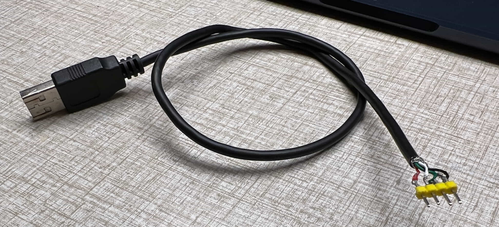

In this [series of posts](https://www.blog.montgomerie.net/tags/switch-dual-shock-adapter-series/), I'm attempting to make a [Dual Shock](https://en.wikipedia.org/wiki/DualShock) to [Switch](https://www.nintendo.com/switch/) controller adapter. It will plug into the Switch Dock's USB port.

[In the first post of this series](https://www.blog.montgomerie.net/posts/2022-12-21-making-a-dual-shock-to-nintendo-switch-controller-adapter/), I got a development environment set up, a programmed ATmega8A onto a breadboard, and code I wrote controlling a blinking LED. In this post, I plan to get [V-USB](https://www.obdev.at/products/vusb/index.html) set up, and an LED blinking on a breadboard - OVER USB!

<!--more-->

As mentioned previously, the ATmega8A doesn't have any built-in USB hardware - but there's a well respected software library called [V-USB](https://www.obdev.at/products/vusb/index.html) that implements the USB protocol in software at the expense of taking some CPU time and a little timing flexibility from us. For most uses - and hopefully for this project - neither of these are issues.

It's licensed under GPL 2 or 3 - basically meaning that if you distribute anything based on it you also have to offer the source code to anyone you distribute it to - and give *them* the right to modify it and distribute it too under similar terms. In the case of V-USB, if _don't_ want to distribute your source you can get a commercial license from the creators, Objective Development. 

I suspect there are a lot of V-USB license violations out there. But it's fine for this project - I'll be showing you the source code anyway!


## Getting V-USB

Let's get V-USB. There's been a bit of development and bug fixing since the last official release (in 2012!), so I'm going to use the latest code from [the V-USB GitHub repo](https://github.com/obdev/v-usb).

To software folks like me, the way embedded folks distribute libraries is a little odd, and often involves just copying and modifying source code. For V-USB, The traditional way is to download a [release from the web site](https://www.obdev.at/products/vusb/download.html), unzip it, and just copy the `usbdrv` folder into your project - changing some files to configure it.

In a PlatformIO project, you can often just put libraries into the 'lib' folder that PlatformIO creates and it'll take care of the rest. Unfortunately we _can't_ just add V-USB as-is there because most of the files we need are in a `usbdrv` subdirectory, and, perhaps more importantly, there's a bunch of stuff - like example programs for USB devices and computers - that we _don't_ want.

After much consternation, what I did is put a copy of the full V-USB directory at the top-level of my project, and symlink the files we really need into place in the lib directory. That way, I can get things compiling cleanly without changing the V-USB folders in any way.

I'm using Git to manage my project, so I used `git subtree` to make the directory:

```
jamie@Jamies-Air ~/D/SwitchControllerAdapter (main)> git remote add -f v-usb https://github.com/obdev/v-usb
Updating v-usb
From https://github.com/obdev/v-usb
 * [new branch]          master     -> v-usb/master

jamie@Jamies-Air ~/D/SwitchControllerAdapter (main)> git subtree add -P v-usb v-usb/master --squash
Added dir 'v-usb'

jamie@Jamies-Air ~/D/SwitchControllerAdapter (main)> ls v-usb
Makefile         circuits/        libs-host/       usbdrv/
README.md        examples/        mkdist.sh*       v-usb.xcodeproj/
Readme.txt       libs-device/     tests/
```

Next, I symlinked the actual bits of V-USB we need into place:

```
jamie@Jamies-Air ~/D/SwitchControllerAdapter (main)> mkdir lib/v-usb
jamie@Jamies-Air ~/D/SwitchControllerAdapter (main)> cd lib/v-usb
jamie@Jamies-Air ~/D/S/l/v-usb (main)> ln -s ../../v-usb/usbdrv .
jamie@Jamies-Air ~/D/S/l/v-usb (main)> ln -s ../../v-usb/libs-device/osctune.h .
jamie@Jamies-Air ~/D/S/l/v-usb (main)> cd ..
jamie@Jamies-Air ~/D/S/lib (main)> cd ..
jamie@Jamies-Air ~/D/SwitchControllerAdapter (main)> 
```

What this does is make a [symbolic link](https://en.wikipedia.org/wiki/Symbolic_link) from the files in the V-USB folder to PlatformIO's `lib` folder, so PlatformIO's build system sees only the files necessary to compile V-USB[^entirelibhierarchy]. If you're following along on Windows, I wish you luck. I [think it's possible there nowadays](https://blogs.windows.com/windowsdeveloper/2016/12/02/symlinks-windows-10/) too.


## Getting V-USB to compile

Okay! Let's see how we're doing? Is V-USB working now?

First, I'll need to hint to PlatformIO that we're actually _using_ V-USB. I added this to my `main.cpp` file, just under the existing Arduino `#include`:

```
#include <usbdrv/usbdrv.h>
```

And hit 'Build'!

```
...
lib/v-usb/usbdrv/usbdrvasm.asm: Assembler messages:
lib/v-usb/usbdrv/usbdrvasm.asm:20: Error: unknown opcode `end'
*** [.pio/build/ATmega8/libecd/v-usb/usbdrv/usbdrvasm.asm.o] Error 1
...
In file included from lib/v-usb/usbdrv/usbdrv.c:10:0:
lib/v-usb/usbdrv/usbdrv.h:127:10: fatal error: usbconfig.h: No such file or directory
...
```

Hmm. Two errors 🙁 (actually, more I've omitted above - but it's all caused by the same two problems). Let's take them one at a time.

For the first one:

```
lib/v-usb/usbdrv/usbdrvasm.asm: Assembler messages:
lib/v-usb/usbdrv/usbdrvasm.asm:20: Error: unknown opcode `end'
```

If you take a look at the file it mentions, `lib/v-usb/usbdrv/usbdrvasm.asm`, you will see it says that it's for the "IAR compiler/assembler system". That's not what we're using. And all that file actually does is include `usbdrvasm.S` - which PlatformIO is already successfully compiling for us. We can likely just not compile `usbdrvasm.asm`, it looks like it's not needed. We'll come back to this after we deal with the second error.

The second error, `fatal error: usbconfig.h: No such file or directory` should not really be too surprising. We still need to configure V-USB - and that's done by making a file called `usbconfig.h`. So the reason compilation is failing is that we haven't done that yet. Making this file is not as arduous as it sounds - it's generally done by copying the provided `usbconfig-prototype.h` header file to `usbconfig.h` and making small changes to it. 

I don't really want to make my own `usbconfig.h` in our otherwise pristine copy of V-USB though. I'd like to keep that as a 'clean' copy. So, instead, I will put my configuration header in the top-level `include` folder PlatformIO made. I'll leave it unchanged for now - I want to stick with the default configuration until we've got compilation working.

We have two things we need to do now. We need to somehow let V-USB know we've put its config file in another folder (fixing the second error), and we also need to make PlatformIO skip the needless, erroring compilation of `usbdrvasm.asm` we talked about before (fixing the first error).

Most things in PlatformIO can be configured in the `platformio.ini` file (and we made a few configuration changes in it in the [last post](https://www.blog.montgomerie.net/posts/2022-12-21-making-a-dual-shock-to-nintendo-switch-controller-adapter/)). Unfortunately, it's not *quite* possible to do the things we want now just by editing `platformio.ini`. But that's okay - the makers of PlatformIO have made it possible to configure it further by writing Python code. Don't be too nervous - we're just going to need a little.

To hold the Python configuration code, I made a `v-usb_platformio_helper.py` file at the top level of the folder, beside `platformio.ini`. We can use it to add some '[build middleware](https://docs.platformio.org/en/latest/scripting/middlewares.html)', which enables us to do things like skip files or to add compiler flags (and many other things!)

``` python
Import("env")

# V-USB has a '.asm' file in the usbdrv folder that PlatformIO will try to 
# compile - but it's really just for the "IAR compiler/assembler system" and 
# will just cause errors. We'll make it be skipped.
def skip_file(node):
    return None
env.AddBuildMiddleware(skip_file, "*/lib/v-usb/*.asm")

# Make sure V-USB can find its config file, which we've placed inside the 
# top-level include folder, and header files in the v-usb library directory.
def add_usbdrv_include(node):
    return env.Object(
        node,
        CFLAGS=env["CFLAGS"] + ["-Iinclude", "-Ilib/v-usb"],
        ASFLAGS=env["ASFLAGS"] + ["-Iinclude", "-Ilib/v-usb"],
    )
env.AddBuildMiddleware(add_usbdrv_include, "*/lib/v-usb/*.[chS]")
```

I used the `env.AddBuildMiddleware` method to insert two steps into the build process. The first is to cause the system to skip files matching `*/lib/v-usb/*.asm` (I probably could've just done `*.asm`, but I find it's usually better to be precise). The second is to add flags to allow `.c`, `.h`, or `.S` files in the the `v-usb` library folder to 'see' include files in the `include` folder. You might notice that I've also sneaked an extra `-I` argument in: `-Ilib/v-usb`. Allowing V-USB source to include files in `lib/v-usb` folder is going to be necessary a bit later when we're trying to use the `osctune.h` header.

The only thing remaining to do is to tell PlatformIO to actually use our Python file - back in  `platformio.ini` I added a `extra_scripts = pre:v-usb_platformio_helper.py` line below the `framework = arduino` line[^fullplatformioinifile].

Okay, with this done, let's hit 'Build' again!

```
...<Lots of output>...
Linking .pio/build/ATmega8/firmware.elf
Checking size .pio/build/ATmega8/firmware.elf
Advanced Memory Usage is available via "PlatformIO Home > Project Inspect"
RAM:   [          ]   0.9% (used 9 bytes from 1024 bytes)
Flash: [=         ]   9.8% (used 754 bytes from 7680 bytes)
Building .pio/build/ATmega8/firmware.hex
===================================================================== [SUCCESS] Took 0.72 seconds =====================================================================
```

Woohoo! It all compiled - and, look, we're still using only 754 bytes of program space! Amazing!

Wait, though - isn't that exactly the same amount as we were using before we added V-USB? 

Yes. Although PlatformIO's build system _does_ compile it all, it cleverly doesn't include any code we're not actually _using_ in the final binary. We can expect this to grow as we actually _use_ V-USB.


## Using V-USB

So, great, now we're ready to use V-USB! 

Or are we? Sort of. We still need to configure it. All we've done so far is copy the 'prototype' configuration. 

We *have*, though, reached the end of our configuration of PlatformIO and the build process, and are ready to start actually altering code that does things on the ATmega.


## Configuring V-USB

Now we're get to the part where we get the ATmega running 12.8MHz. I've been mentioning this for some time - but *why* am I doing this? USB requires very precise timing. The [V-USB wiki](http://vusb.wikidot.com/examples) (slightly out of date :-/) describes it like this:

> V-USB requires a precise clock because it synchronizes to the host's data stream at the beginning of each packet and then samples the bits in constant intervals. The longest data packet for low speed USB is [...] a maximum of 84 bits. Bit sampling must not drift more than 1/4 bit during these 84 bits, resulting in a requirement of 0.3% clock precision.

The V-USB code is _very_ carefully written to ensure that it can be this precise. It runs when data starts arriving on the data lines of the USB connection, and samples the data in very cleverly written assembly code that hits the required timing precisely. There are various versions of the assembly routines for various clock timings and they're all different[^timings]. They only work when the chip is clocked by a source that ensures the frequency is pretty much exactly correct.

The ATmega8A's internal '8MHz' internal oscillator is not precise - but it can be 'tuned' by writing values to the `OSCCAL` byte - a special value that can be accessed from code as a global variable. `OSCCAL` is _intended_ to be used to calibrate the oscillator to run at 8MHz more reliably. It's needed because the characteristics of each individual ATmega8A differ. Being really intended to 'tune' small fluctuations from 8MHz, it's not actually guaranteed that it can be used to make the oscillator reach 12.8MHz. In practice, though, almost every - possibly _really_ every - ATMega8 out there _can_ reach 12.8MHz reliably (some even 16MHz!).

Here's a chart of a 'typical' `OSCCAL`-value-to-MHz ratio from [Microchip's (née Atmel's) AVR053 application note](https://ww1.microchip.com/downloads/en/Appnotes/Atmel-2555-Internal-RC-Oscillator-Calibration-for-tinyAVR-and-megaAVR-Devices_ApplicationNote_AVR053.pdf).


There's no `OSCCAL` value that's guaranteed to produce 12.8MHz though - it will be different for every individual chip - and will even vary over time on one chip with changes to things like temperature and supply voltage.

It sure sounds like the internal oscillator is not suitable as a clock source that has a "a requirement of 0.3% clock precision". How would we even know what value to set `OSCCAL` to? And if it varies with things like temperature that just sounds terrible! We'd need to constantly recalibrate it. And even if we could work out how to do that, we'd need a precise timer to use as a reference. 

So, no, it's not a suitable clock source as it stands. But it can be made to be one! 

Back in 2008, [Henrik Haftmann](https://www-user.tu-chemnitz.de/~heha/) had the idea that you could calibrate the clock using pulses that the USB host (i.e. the computer) sends to the USB device as a timing reference. The V-USB-using device could measure the time between each USB 'Start Of Frame' message send by the host - this is required to be exactly 1ms. If the device, using its own clock, measures greater than than 1ms between each SOF, it knows that means its clock is inaccurate, so it can speed it up a bit to get back on track. If it measures less than 1ms between each frame, it can slow its clock down a bit. 

Do that often enough, and it can make its clock almost as accurate and precise as the USB host it's plugged into.

This clever idea is implemented in the `osctune.h` file in V-USB. V-USB is not configured to use it by default, though[^crystal], so I'll need to configure it.

I'll also need to need to set up the way the the ATmega is connected to the USB lines to allow the code in `osctune.h` to run on every 1ms SOF signal. There are two data lines in pre-USB-3 USB: 'D+' and 'D-' (D for "Data")[^dminusandplus]. The start of this SOF can be reliably detected by a change in the state of the 'D-' line. 

I can't just connect D+ and D- to any ATmega pin I want to. One of them is required, by how V-USB works, to be connected to the pin that can trigger interrupt 0[^interrupt]. On the ATmega8A, that's pin 4. V-USB also requires that the other data line be connected to a pin that corresponds to a bit on the same port[^ports].

There's another restriction: as you might have guessed, the 'osctune.h' routines require that the 'D-' line, not the 'D+' line, be connected to the interrupt 0 pin. So, I'll need to connect 'D-' to pin 4 - which besides being able to trigger interrupt 0 is also bit 2 of port D. 

I'll connect D+ to the pin right next to it, pin 5 - it's bit 3 of port D. You can see the pin to port correspondence in the pinout diagram from [the datasheet](https://ww1.microchip.com/downloads/en/DeviceDoc/ATmega8A-Data-Sheet-DS40001974B.pdf):


Note that pin 4 is labeled '(INT0) PD2' and pin 5 is labeled '(INT1) PD3'. 

I might come to regret using pin 5 later, if I want to use interrupt 1 for something - but if that happens I can easily re-configure and use one of the other Port D pins. I'll use these for now just because they're next to each other.

To tell V-USB about our pin assignment I cracked open the `usbconfig.h` file I copied earlier. The things that need changing were pretty near the top. `USB_CFG_IOPORTNAME` was already set to `D`. I changed `USB_CFG_DMINUS_BIT` to `2`, and `USB_CFG_DPLUS_BIT` to `3`. I also set things up to use the dynamic clock tuning implemented in `osctune.h`: at the _very bottom_ of the file, just _before_ the `#endif`, I added a line saying `#include "osctune.h"`.

In the `osctune.h` file itself there are instructions saying that:

> You must declare the global character variable "lastTimer0Value" in your main code.

so I also did that - back in `main.cpp` I added a new global variable:

```cpp
uchar lastTimer0Value = 0;
```

Time to hit 'Build'. It compiles!

But it's still not _doing_ anything - the code in `main.cpp` is still just the old LED-blinking code. Now that V-USB is configured, I'll have to add some code to initialize it.

## Actually writing some V-USB code!

There are two things we need to do for a simple 'does nothing' device:

- Initialize the library and USB connection[^initialize].
- Implement a `usbMsgLen_t usbFunctionSetup(uchar data[8])` function. V-USB will call this with incoming 'setup' data is received from the host (I'll leave it empty for now);
- Regularly call `usbPoll()`. According to the documentation, no longer than 50ms must pass between calls.

I'll add code to do all that to `main.cpp`. 

I'd like to leave in the 'blinking' - but I will need to change how it works. We need to call `usbPoll()` every 50 milliseconds, so I can't use blocking `delay()` calls. Instead, I'll keep track of when the last toggle of the LED was and toggle it every time the code calculates that it's been more than a second since the last toggle.

Here's my `main.cpp` now:

```C++
#include <Arduino.h>

#include <usbdrv/usbdrv.h>
uchar lastTimer0Value = 0;

usbMsgLen_t usbFunctionSetup(uchar data[8])
{
    return 0;
}

void setup()
{
    pinMode(LED_BUILTIN, OUTPUT);

    // Disable interrupts for USB reset.
    noInterrupts();         

    // Initialize V-USB.
    usbInit(); 

    // V-USB wiki (http://vusb.wikidot.com/driver-api) says:
    //      "In theory, you don't need this, but it prevents inconsistencies 
    //      between host and device after hardware or watchdog resets."
    usbDeviceDisconnect(); 
    delay(250); 
    usbDeviceConnect();
    
    // Enable interrupts again.
    interrupts();           
}

void loop()
{
    static unsigned long lastBlink = 0;

    unsigned long timeNow = millis();
    if(timeNow - lastBlink >= 1000) {
        lastBlink = timeNow;
        digitalWrite(LED_BUILTIN, !digitalRead(LED_BUILTIN));
    }

    usbPoll();
}
```

Lets-a go! Hit build!

```
/var/folders/6p/89bzfdg51_73bct78x16tgy80000gn/T//cccI9Rdo.ltrans0.ltrans.o: In function `main':
<artificial>:(.text.startup+0x6c): undefined reference to `usbInit()'
<artificial>:(.text.startup+0x17e): undefined reference to `usbPoll()'
collect2: error: ld returned 1 exit status
*** [.pio/build/ATmega8/firmware.elf] Error 1
```

Uh-oh. It looks like the functions we're calling are missing?!...

This stumped me for a bit. What's actually going on is that V-USB is written in *C*, but we're writing `main.cpp` in *C++* as is standard for Arduino-framework code. It's actually easy to make them work together - we just need to tell the compiler what's going on. To do that I enclosed the V-USB `#include` - and the `lastTimer0Value` declaration - in an `extern "C"` block:

```C++
extern "C" {
    #include <usbdrv/usbdrv.h>
    uchar lastTimer0Value = 0;
}
```

Okay! let's build again!

```
Linking .pio/build/ATmega8/firmware.elf
Checking size .pio/build/ATmega8/firmware.elf
Advanced Memory Usage is available via "PlatformIO Home > Project Inspect"
RAM:   [=         ]   5.8% (used 59 bytes from 1024 bytes)
Flash: [===       ]  31.9% (used 2450 bytes from 7680 bytes)
=================================================== [SUCCESS] Took 0.41 seconds ===================================================
```

Look! It built! And the amount of flash our code is taking up has gone up to 2,450 bytes.

That's our does-nothing software basically done!

I'm going to do one last thing, which is to refactor a little to put the LED flashing into its own 'heartbeat' function and leave our main loop nice and clean. That, plus a few more comments, leaves us with this:

```C++
#include <Arduino.h>

extern "C" {
    #include <usbdrv/usbdrv.h>

    // We declare this to be used by V-USB's 'osccal.h' oscillator calibration 
    // routine.
    uchar lastTimer0Value = 0;
}

usbMsgLen_t usbFunctionSetup(uchar data[8])
{
    return 0;
}

void setup()
{
    pinMode(LED_BUILTIN, OUTPUT);

    // Disable interrupts for USB reset.
    noInterrupts();         

    // Initialize V-USB.
    usbInit(); 

    // V-USB wiki (http://vusb.wikidot.com/driver-api) says:
    //      "In theory, you don't need this, but it prevents inconsistencies 
    //      between host and device after hardware or watchdog resets."
    usbDeviceDisconnect(); 
    delay(250); 
    usbDeviceConnect();
    
    // Enable interrupts again.
    interrupts();           
}

// Call regularly to blink the LED every 1 second.
static void heartbeat()
{
    static unsigned long lastBlink = 0;

    unsigned long timeNow = millis();
    if(timeNow - lastBlink >= 1000) {
        lastBlink = timeNow;
        digitalWrite(LED_BUILTIN, !digitalRead(LED_BUILTIN));
    }
}

void loop()
{
    heartbeat();
    usbPoll();
}
```


## Breadboarding the USB connection

Software done (well, for now) - now we just need to put this hardware together!

When we left our breadboard at the end of part 1, it was connected to a 5v power supply, and happily blinking its LED.

I need to change it now so that it's powered by a USB connection, and has the pins we defined above connected to the D+ and D- lines.

USB (at least, until USB 3) has four conductors - +5v, D-, D+ and GND, so it seems like this should be pretty easy, right? Just connect things up! 

It's not _quite_ that straightforward, unfortunately.

First, how can I physically connect a USB port to a breadboard? Well, there are plenty of commercial ["Micro-USB DIP adapters"](https://www.ebay.com/sch/i.html?_nkw=micro-USB+dip+adaptor) I could just buy one of these, plug it into the breadboard, and plug a USB cable into it. 

But I went a more 'do it immediately' and 'do it for free' route: I cut up a broken USB cable I literally found on the street a while ago, stripped the wires, and soldered on a 4-pin 2.54mm header. Behold!



If you go this ~~dodgy~~ wise and frugal route, you should be sure that you know which wire in the cable corresponds to which USB line. _Usually_, the wires will be colored red for +5V, white for D+, green for D-, and black for ground. There are reportedly some cables out there with non-standard coloring though, so be careful! For +5V and GND, check with a multimeter - you can break your components and potentially also your computer if you get this wrong! For D+ and D-, you can just connect them up the way you think will work and switch them if it turns out to be wrong.

Great, so now I have my USB connection sorted, I can just connect this all up on a breadboard, right? Well, not so fast: the D+ and D- lines are meant to be pulled to 0.0–0.3V for low, and *2.8–3.6V* for high - that's _way less_ than the 5V that's supplied on the power line. 

The [ATmega8 datasheet tells us, in its Electrical Characteristics section](https://ww1.microchip.com/downloads/en/DeviceDoc/Atmel-2486-8-bit-AVR-microcontroller-ATmega8_L_datasheet.pdf#page=235) that when running at 5V a output low voltage has a max of 0.9v (so a little bit too high, potentially), and an output high voltage has a max of 4.2V (way over 3.6V!) Modern computers have - and probably the Switch has - a lot of protection built in, so, honestly, it might work. But it's playing with fire. If we were to put 4.2v on the data lines it'd be within the rights for the thing we plug it into to just break - perhaps permanently. We'll need to do something about it.

The V-USB docs have a few suggestions[^vusbcircuits] on how to deal with this - the one I chose is to use a low-dropout, low-quiescent current 3.3V voltage regulator to drive the whole circuit at 3.3v instead of 5V. I used a LP2950-3.3 because that's what I had handy. This brings the ATmega's operating voltage down to 3.3V - and so brings the output levels in line with the USB spec. This is easy and will work well. Hopefully it won't come back to haunt me when I try to interface the DualShock controller...

Next, for reasons I admit I don't fully understand (impedance matching? Analog electronics are mostly a mystery to me...)[^68resistors], we need to connect ~68Ω resistors between the D+ and D- lines and the ATmega's IO pins rather than connecting them directly. I will just use a couple of resistors instead of jumper wires to connect the lines to the ATmega on the breadboard.

Lastly, we also need a 1.5kΩ resistor between D- and 3.3V. This is to signal to the host that we're a "Low Speed" (1.5Mbit/s) device.

This is what my breadboard looks like now. I had to move the ATmega over a little to make room for my new LP2950 'power supply', and I've switched to a red LED and a 130Ω resistor for a bit more brightness with the 3.3V source, but otherwise it's still the same:


At last - here we go! Cross your fingers - I'm going to plug this thing in to my computer!



The LED is blinking! And, because of our `OSCCAL` clock synchronization, it is blinking with a precise 1s on/off rather than the 1.6s period we saw before. 

The USB communication with the computer is working!

But wait, there's more - the computer should know about the device too! 

On my Mac, I can see this by opening the "System Information" app and looking in the Hardware -> USB pane:


Note the device with the name "Template" and the manufacturer "obdev.at" - that's the default name and manufacturer defined in `usbconfig.h`. The ATmega communicated this to the computer over USB!

We'll change that template naming later, when we actually implement some functionality.

`system_profiler SPUSBDataType` will print similar information to a Terminal window. On Linux, `lsusb` at the command line will show you something similar. [There is reportedly a way to get this information on Windows too](https://superuser.com/questions/1411312/is-there-an-equivalent-to-linuxs-lsusb-in-windows).

## Conclusion

For now, this seems like a good point to stop again - once again with a blinking LED. But this time it's a **USB blinking LED**!

If you're anything like me, you'll now leave your new "USB LED blinking device" out and plugged in on your desk while you work and give it a satisfied glance every now and then.

See you next time, when I will try to actually communicate with a Nintendo Switch!

*You can follow the code for this series [on GitHub](https://github.com/th-in-gs/SwitchDualShockAdapter). The `main` branch there will grow as this series does. The [`blog_post_2`](https://github.com/th-in-gs/SwitchDualShockAdapter/tree/blog_post_2) tag corresponds to the code as it is (was) at the end of this post.*

*All the posts in this series will be [listed here as they appear]([)https://www.blog.montgomerie.net/tags/switch-dual-shock-adapter-series).*


[^entirelibhierarchy]: The entire structure should now look like this:

	```
	jamie@Jamies-Air ~/D/SwitchControllerAdapter (main)> find -L ./lib
	./lib
	./lib/README
	./lib/v-usb
	./lib/v-usb/osctune.h
	./lib/v-usb/usbdrv
	./lib/v-usb/usbdrv/usbdrvasm18.inc
	./lib/v-usb/usbdrv/oddebug.h
	./lib/v-usb/usbdrv/usbconfig-prototype.h
	./lib/v-usb/usbdrv/usbdrvasm.asm
	./lib/v-usb/usbdrv/usbdrv.c
	./lib/v-usb/usbdrv/usbportability.h
	./lib/v-usb/usbdrv/usbdrvasm20.inc
	./lib/v-usb/usbdrv/usbdrvasm128.inc
	./lib/v-usb/usbdrv/asmcommon.inc
	./lib/v-usb/usbdrv/usbdrvasm12.inc
	./lib/v-usb/usbdrv/usbdrvasm16.inc
	./lib/v-usb/usbdrv/usbdrvasm15.inc
	./lib/v-usb/usbdrv/usbdrvasm18-crc.inc
	./lib/v-usb/usbdrv/Changelog.txt
	./lib/v-usb/usbdrv/Readme.txt
	./lib/v-usb/usbdrv/CommercialLicense.txt
	./lib/v-usb/usbdrv/USB-ID-FAQ.txt
	./lib/v-usb/usbdrv/usbdrvasm.S
	./lib/v-usb/usbdrv/oddebug.c
	./lib/v-usb/usbdrv/License.txt
	./lib/v-usb/usbdrv/usbdrvasm165.inc
	./lib/v-usb/usbdrv/USB-IDs-for-free.txt
	./lib/v-usb/usbdrv/usbdrv.h
	```


[^fullplatformioinifile]: For reference, it should now look something like this all together:

	```ini
	; PlatformIO Project Configuration File
	;
	;   Build options: build flags, source filter
	;   Upload options: custom upload port, speed and extra flags
	;   Library options: dependencies, extra library storages
	;   Advanced options: extra scripting
	;
	; Please visit documentation for the other options and examples
	; https://docs.platformio.org/page/projectconf.html
	
	[env:ATmega8]
	platform = atmelavr
	board = ATmega8
	framework = arduino
	
	; Some python help to build V-USB without modifying its source.
	extra_scripts = pre:v-usb_platformio_helper.py
	
	
	; Chip configuration:
	
	; BODLEVEL=1, BODEN=0, SUT=10, CKSEL=0100
	board_fuses.lfuse = 0xA4
	
	; RSTDISBL=1, WTDON=1, SPIEN=0, CKOPT=1, EESAVE=0, BOOTSZ=00, BOOTRST=1
	board_fuses.hfuse = 0xD1
	
	; This configures the _software_ to assume a 12.8 MHz clock - it does not affect
	; the chip itself.
	; We configure the chip with fuses, above, to use the built-in 8MHz internal 
	; oscilator. We'll then calibrate it in software to run 'too fast' at 12.8MHz.
	board_build.f_cpu = 12800000
	
	
	; PlatformIO programmer settings:
	
	; Settings to use an Arduino-as-ISP-powered programmer.
	; On Windows, `upload_port` might be e.g. 'COM1' rather than a path.
	; On Mac and Linux, the path might differ depending on the Arduino and/or
	; serial connection.
	upload_port = /dev/cu.usbserial-110
	upload_protocol = stk500v1
	upload_speed = 19200
	
	; Sadly-needed workarounds:
	; -e: 
	;   From the 'avrdude' docs: "Causes a chip erase to be executed. This will 
	;   reset the contents of the flash ROM and EEPROM to the value ‘0xff’, and 
	;   clear all lock bits. Except for ATxmega devices which can use page erase, it
	;   is basically a prerequisite command before the flash ROM can be reprogrammed 
	;   again. The only exception would be if the new contents would exclusively 
	;   cause bits to be programmed from the value ‘1’ to ‘0’."
	; -P and -b:
	;   PlatfomIO's '--target fuses' doesn't work without it - the 'upload_XXX' 
	;   settings are not used even though they need to be.
	; -u: 
	;   Work around the same issue relating to a  "fake" efuse described as
	;   affecting the Windows Arduino IDE here:
	;   https://github.com/arduino/arduino-cli/issues/844
	upload_flags =
		-e
		-P${UPLOAD_PORT}
		-b${UPLOAD_SPEED}
		-u
	```

[^timings]: 12 MHz, 12.8 MHz, 15 MHz, 16 MHz, 16.5 MHz, 18 MHz or 20 MHz. You can see them in the `usbdrvasmXX[X].inc` files in V-USB's source code.

[^crystal]: By default it's configured expecting that the ATmega will be clocked with an external 16MHz timing crystal. Quartz timing crystals are more accurate than the internal oscillator, so don't need to be tuned - they can be relied upon to run at a precise enough 16MHz without intervention.

[^dminusandplus]: We may get more into what's transmitted on those lines in the future - for now, if you want to know more about it I'd recommend [this excellent video by Ben Eater](https://youtu.be/wdgULBpRoXk)

[^interrupt]: 'Interrupts' are a feature of most processors. Processors have circuitry that can detect a change of state in something (like an IO pin going from high to low). When it senses that change of state, the processor will immediately stop what it's doing and execute an 'interrupt handler' - basically a specially registered function. After an interrupt handler is finished, the processor goes back to doing whatever it was doing before, with the original code none the wiser that it was interrupted unless it's measuring elapsed time or something. The naming of 'interrupts' is quite intuitive - they literally do cause the processor to interrupt whatever code was already running and do something else for a short while. On the ATmega8A, the handler for 'interrupt 0' can be configured to run when the state of pin 4 changes. V-USB uses this to run its USB data reception function whenever there's activity on the data lines.

[^ports]: A 'port' is a name given to a byte of memory-mapped IO. Even if you're an Arduino veteran, you might not have encountered this before - but if you're used to using functions like `digitalWrite()` or `digitalRead()`, they're using 'ports' inside. On the ATmega, there are three `PORT` and `PIN` bytes available as *global variables* to *all* your code.

	Take a look again at the pin-out diagram of our ATmega8A from [the datasheet](https://ww1.microchip.com/downloads/en/DeviceDoc/ATmega8A-Data-Sheet-DS40001974B.pdf):
	
	
	
	You will see that all the pins on the chip are labeled with "port bit" labels - 'PD0', 'PC6', 'PB4' etc. The `PORTD` global variable, for example, contains, as its individual 8 bits, the output state of the physical pins labeled with the prefix 'PD' on that diagram - with a '1' for output high, and a '0' for output low. For example, if you were to set the third bit of the global `PORTD` variable, it would, presuming it was configured as an output, set state of the pin labeled 'PD3' - pin 5. The output state of pin 28, labeled 'PC5' in the diagram, is represented as third bit in the global `PORTC` variable. 
	
    If the pins are configured for _input_, you can _read_ the state of the similar `PIN`-prefixed variables to get their state. Looking at the bits of `PINC` would get you the state of the pins making up port C - those labeled with a `PC` prefix.
	
	*Note that an earlier revision of this post incorrectly conflated the PORTx and PINx variables. Despite its apparent simplicity, port confuses me too sometimes!*

[^initialize]: Informed by the [V-USB wiki](http://vusb.wikidot.com/driver-api) and the examples included in the V-USB repo.

[^vusbcircuits]: Check out [this read-me](https://github.com/obdev/v-usb/blob/master/circuits/Readme.txt), and the folder that contains it.

[^68resistors]: Some discussion from the designers of V-USB on the 68Ω resistors [can be found here](https://forums.obdev.at/viewtopic46cd.html?t=1394). They say it's for these reasons:
	
	> * Limit the current if zener diodes are used for voltage limiting on D+ and D-. 
	> * Limit the current in case of short circuit or if higher voltage is applied from extern. 
	> * To some degree impedance matching to the cable when sending data. 
	> * Low pass filter to avoid ringing when level is switched. 
